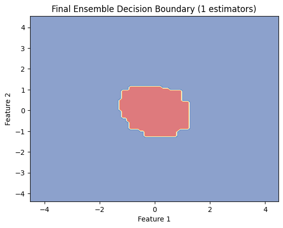
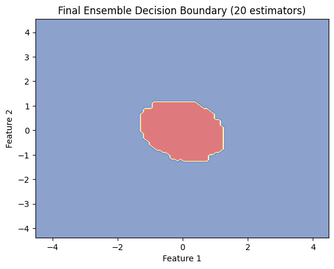
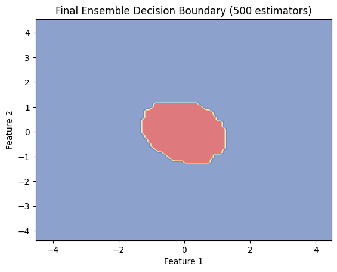
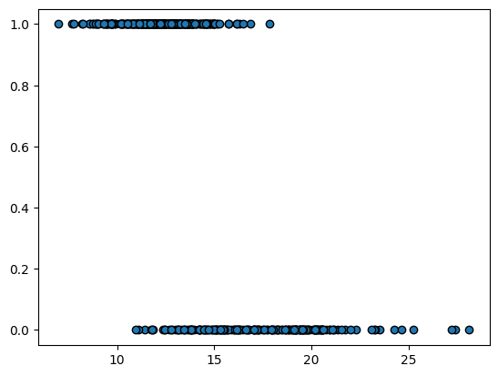

# Lab Report: Bagging Classifiers

In this lab, we made 2 **bagging** algorithms with base classes as **Decision Tree** and **Logistic Regression**.

---

## Part 1: Bagging with Decision Trees on a Custom Dataset

We first made a custom dataset using `numpy` random functions and made an appropriate `y` value according to `x`. Then we made a single class for both logistic or decision tree, with arguments as no. of estimators and depth of tree in case of decision tree.

Though even a single model was able to accurately predict the output variable, we did get a slightly better result with using a **bagging** method.

These are the plots of `x` and `y` and following them are plots for 1 estimator, 20 estimators, and 500 estimators.

You can notice that even with too many models, the model doesn't rush to **overfit** the data, and that is the beauty of the bagging methods. This allows it to learn the representation of data, but due to randomness and voting schemes, provides an accurate representation at inference.

---

## Part 2: Bagging with Logistic Regression on Cancer Dataset

Further, we trained a similar **bagging** classifier with **Logistic Regression** on the `sklearn` cancer dataset and tested it on both 1 classifier and 20 classifiers.

The results were good for both of the models due to the nature of data being easily fittable to a sigmoid function. For example, here is feature one with respect to `y`; you can clearly see the activation, like the sigmoid.

